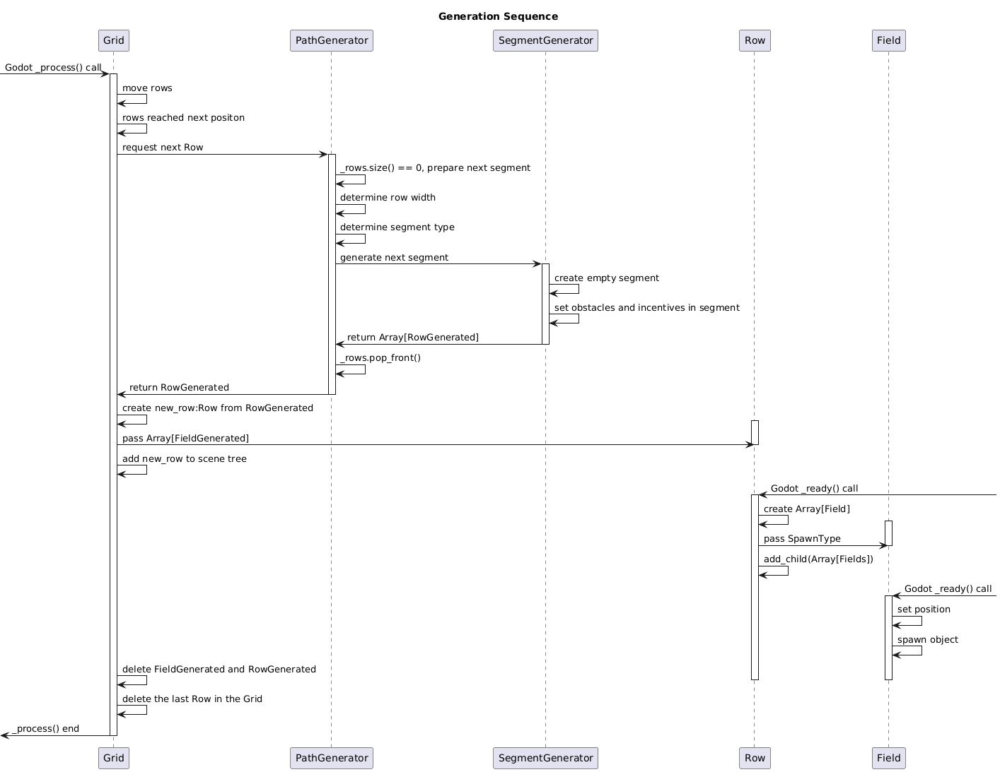

# godot-runner-game-path-generator
A field-based path generator with variable width for runner games in Godot.

The project contains a Godot example of a path generator for endless runner games.
I developed the generator for my runner game Cuber:

**https://store.steampowered.com/app/3924320/Cuber/**

This project contains a shorted version with the base concepts of the generator.

## How to use
 - Import the project in Godot 4.5 or later
 - In Godot execute the main scene

## Overview - important classes and terms
 - FieldGenerated - a data representation of a field, created by SegmentGenerator, will be mapped in an visible Field by a Row
 - RowGenerated - a data representation of a Row, created by SegmentGenerator, will be mapped in an visible Row by the Grid
 - Segment - an Array of 10 following RowGenerated
 - Segment Type - determines how obstacles are placed on a segment
 - Field - actual visible Field, is part of a Row. Can contain an obstacle or incentive
 - Row - actual visible Row, consists of Fields
 - SpawnType - used to determine if and which object a Field should spawn
 - Grid - contains Rows and moves them
 - PathGenerator - decides the segment type and row-width
 - SegmentGenerator - creates Segments of different types

Other classes like Player, UI, obstacles or incentives are used for better showcase but are not required to generate the endless path.

### Generation Sequence

